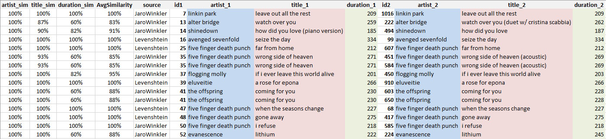

# DeezerAnalysisAI-R
An R script that uses AI for data analysis on Deezer playlists, like looking for fuzzy duplicates, creating ranks of genre and artists.

## Currently working:
- Duplicates search, both for exact matches (artist, title and duration) and for possible duplicates based on high similarity, the later using both the Levenshtein and Jaro & Winkler algorithms

## Next improvements
- Full playlist extract, to help with local/cloud backups and migration of playlists to other platforms
- Overall analysis of playlist, like genres, top artists, tracks lengths, etc.
